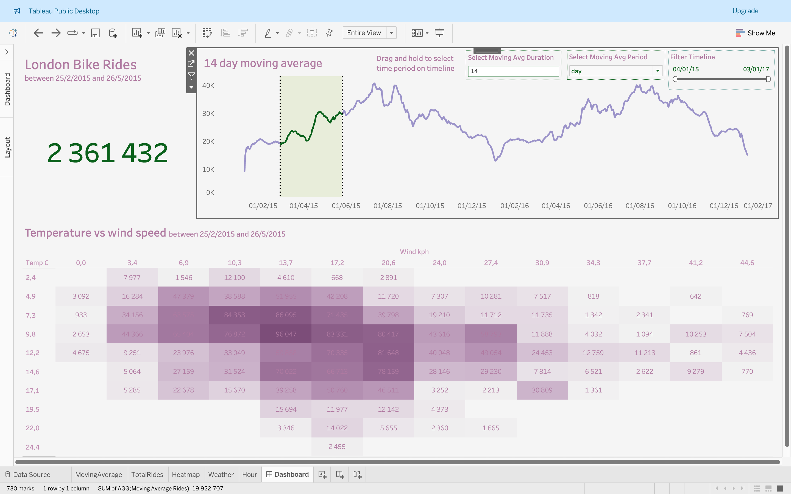
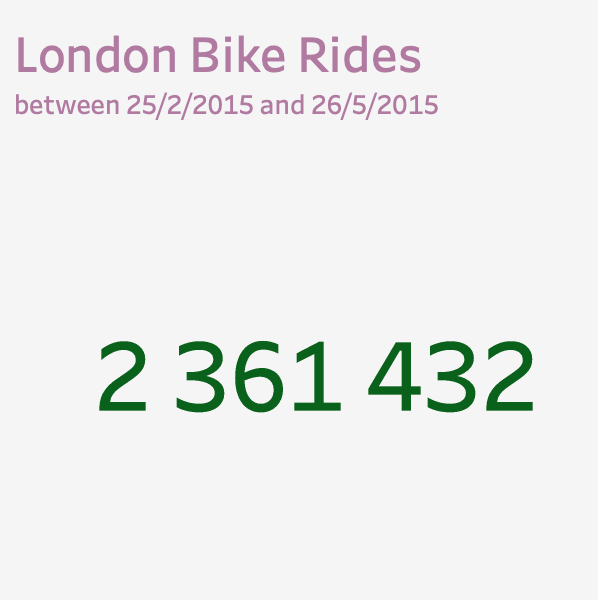
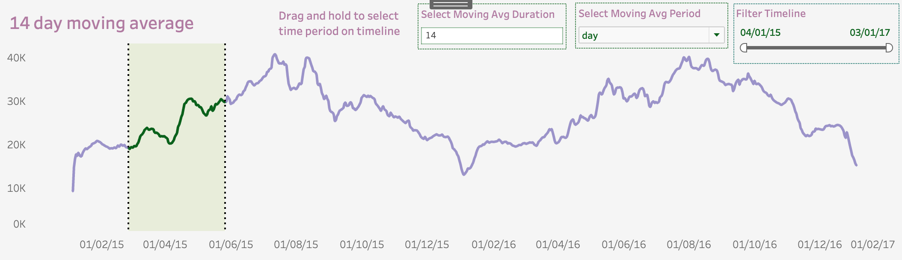
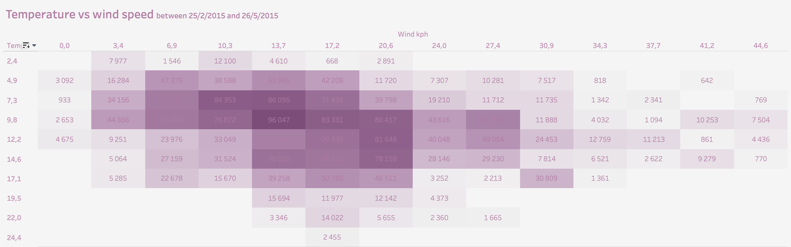

# London Bike Rides Analysis

## Overview

This project analyzes bike-sharing data in London to uncover trends, patterns, and the impact of weather conditions on bike usage. Using Python for data processing and Tableau for visualization, the project provides insights into how temperature, wind speed, and other factors influence the frequency of bike rides.

## Project Structure

- **Data Processing (Python):** The initial data is processed using Python, including cleaning, transforming, and aggregating the bike ride data.
- **Visualization (Tableau):** The cleaned data is then visualized in Tableau, creating interactive dashboards to explore trends and insights.

## Key Insights

- **Total Bike Rides:** Over 2 million bike rides were recorded between 25th February 2015 and 26th May 2015.
- **14-Day Moving Average:** The visualization shows long-term trends in bike usage, highlighting peak periods, especially in the spring months.
- **Weather Impact:** The heatmap demonstrates how moderate temperatures and low wind speeds are associated with higher bike usage.

## Dashboard

The Tableau dashboard includes:

- **Total Bike Rides:** Displays the total number of bike rides recorded during the analysis period.
- A 14-day moving average graph showing bike ride trends over time.
- A heatmap that correlates temperature and wind speed with the number of bike rides.

## Graphs

### Graph 1: Total Bike Rides

On our dashboard, you can see a prominent green number showing that more than 2 million rides were made between February 25, 2015, and May 26, 2015. This metric gives us an overall sense of the scale of bike usage in London during that period.

### Graph 2: 14-Day Moving Average

 This graph displays trends in bike usage in London over the entire period. The moving average helps smooth out daily fluctuations, making it easier to understand the overall trends. For example, you can notice that the number of rides increases in the spring months, which may be related to improved weather conditions and more favorable conditions for biking.

### Graph 3: Weather Impact Heatmap

This map shows how different combinations of temperature and wind speed influence the number of rides. For example, we see that the most frequent rides occur at temperatures around 12-15 degrees Celsius with low wind speed. This makes sense since such conditions are the most comfortable for cycling.

## Usage

To explore the analysis:

1. Download the Tableau workbook or open the visualizations in Tableau Public.
2. Interact with the filters and graphs to explore different aspects of the data.

## Files

- **london_bikes_final.xlsx:** The final processed dataset used in Tableau.
- **LondonBikeRides.twbx:** The Tableau workbook containing the visualizations.

## Conclusion
In conclusion, the key takeaways are:

-Weather conditions play a significant role in bike usage. Londoners tend to use bikes more often in moderate temperatures and low wind conditions.

-Seasonal variations also affect overall metrics. Spring and summer are likely to be peak periods for bike rides.

This project provides valuable insights into the factors influencing bike-sharing usage in London. Understanding these patterns can assist in city planning, improving bike-sharing services, and promoting sustainable transportation.
